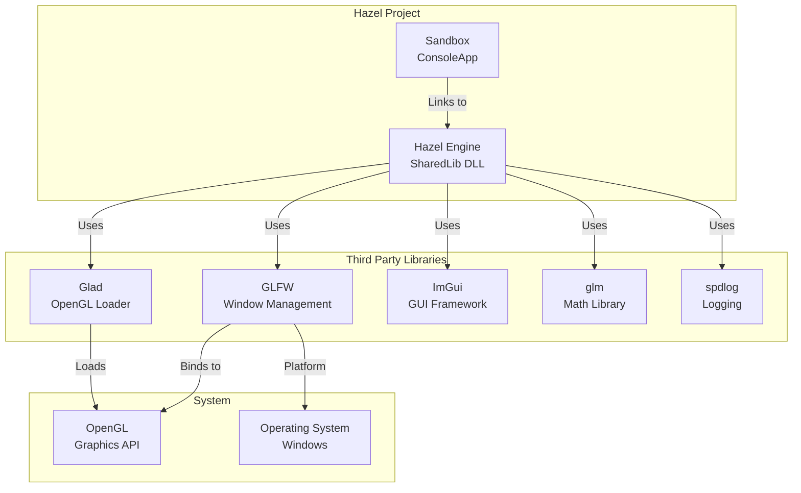
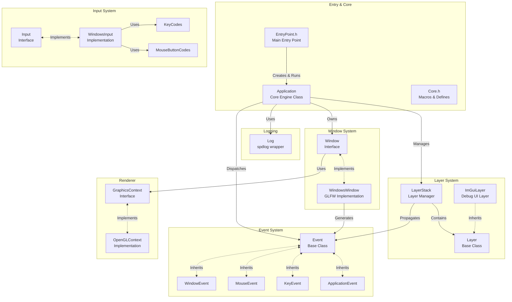
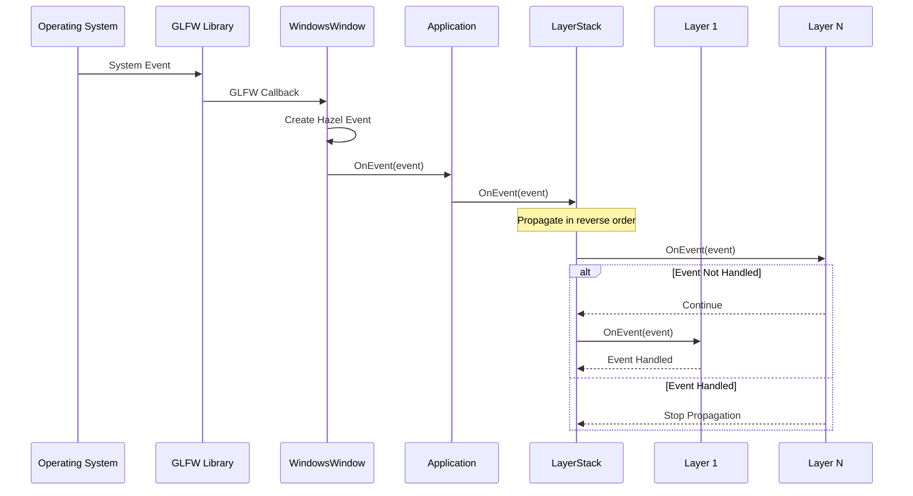
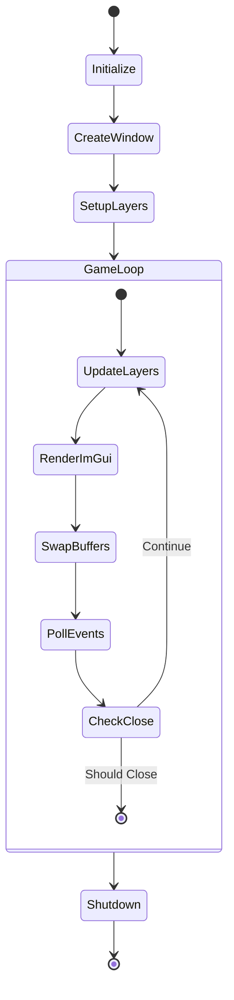
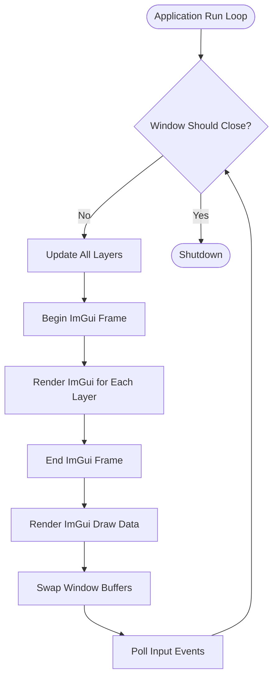
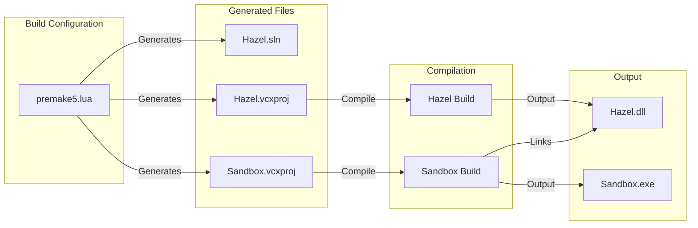
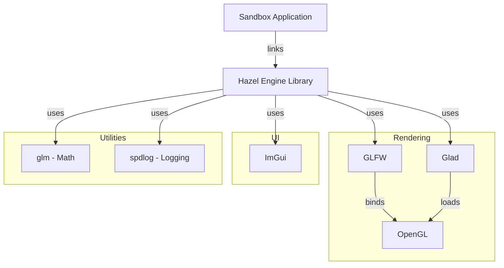
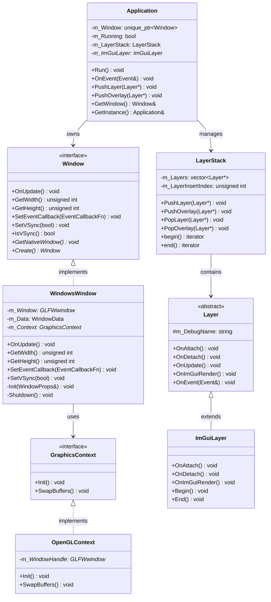
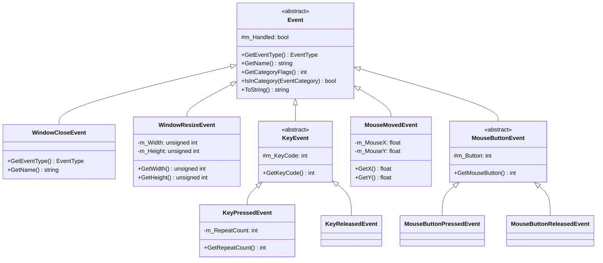
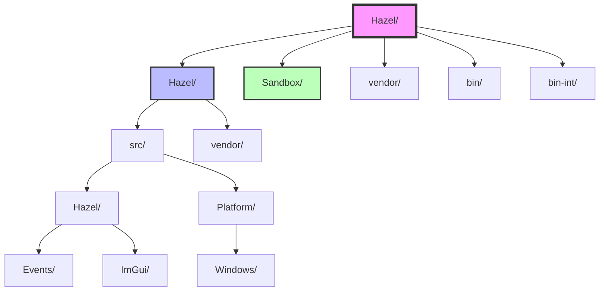

# Hazel Game Engine - Architecture (Mermaid Diagrams)

## 1. 전체 프로젝트 구조

## 2. Hazel 엔진 코어 아키텍처

## 3. 이벤트 처리 흐름

## 4. 애플리케이션 생명주기

## 5. 렌더링 파이프라인

## 6. 빌드 시스템

## 7. 의존성 그래프

## 8. 클래스 다이어그램 - Core

## 9. 클래스 다이어그램 - Event System

## 10. 디렉토리 구조

## 주요 컴포넌트 상세 설명

### Application (엔진 핵심)
- 엔진의 메인 클래스로 게임 루프를 관리합니다
- 싱글톤 패턴으로 전역 액세스를 제공합니다
- Window, LayerStack, Event System을 통합 관리합니다

### Layer System (계층 시스템)
- 게임 로직을 논리적 계층으로 분리합니다
- 업데이트와 렌더링을 계층별로 관리합니다
- Overlay는 일반 Layer보다 항상 위에 렌더링됩니다

### Event System (이벤트 시스템)
- 이벤트 기반 아키텍처를 구현합니다
- 다양한 입력 및 시스템 이벤트를 처리합니다
- 이벤트는 LayerStack을 통해 역순으로 전파됩니다

### Platform Layer (플랫폼 레이어)
- 플랫폼별 구현을 추상화합니다
- 현재는 Windows + macOS(dev scope) GLFW 구현을 제공합니다
- 다른 플랫폼 지원 시 쉽게 확장 가능합니다

### Build System (빌드 시스템)
- Premake5를 사용하여 빌드 설정을 관리합니다
- Debug, Release, Dist 세 가지 빌드 구성을 지원합니다
- Hazel은 DLL로, Sandbox는 EXE로 빌드됩니다
